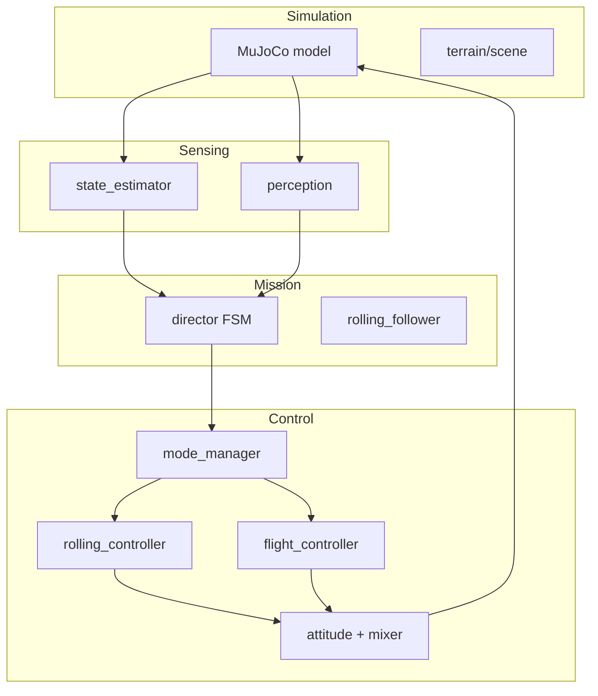

# CAROLLINE Project Curriculum

A structured course for learning the entire `carolline_control` codebase (~103 Python files, ~17k lines). Read chapters in order; later chapters assume earlier ones.

**Previous:** none | **Next:** [01-project-overview.md](01-project-overview.md)

---

## Reading order

| # | Chapter | Time | What you learn |
|---|---------|------|----------------|
| 00 | This page | 10 min | Index, glossary, checkpoints |
| 01 | [Project overview](01-project-overview.md) | 30 min | What CAROLLINE is, repo layout, architecture |
| 02 | [Setup and config](02-setup-and-config.md) | 45 min | Install, YAML configs, `ControllerConfig` |
| 03 | [MuJoCo and physics](03-mujoco-and-physics.md) | 40 min | Models, contacts, markers |
| 04 | [Math and types](04-math-and-types.md) | 60 min | SO(3), dataclasses, control modes |
| 05 | [State estimation](05-state-estimation.md) | 40 min | Oracle vs sensor-only, `RobotState` |
| 06 | [Control stack overview](06-control-stack-overview.md) | 90 min | `CarollineController.compute()` pipeline |
| 07 | [Mode manager and planner](07-mode-manager-and-planner.md) | 60 min | FSM transitions, waypoints |
| 08 | [Rolling and ground control](08-rolling-and-ground-control.md) | 75 min | Rolling, contacts, recovery |
| 09 | [Flight and takeoff](09-flight-and-takeoff-control.md) | 60 min | Geometric flight controller |
| 10 | [Actuation pipeline](10-actuation-pipeline.md) | 45 min | Attitude → motors → ESC |
| 11 | [LQR and MPC](11-alternative-controllers-lqr-mpc.md) | 30 min | Alternative controllers (benchmark) |
| 12 | [Autonomous navigation](12-autonomous-navigation.md) | 120 min | Director, perception, course |
| 13 | [Terrain and scenes](13-terrain-and-scenes.md) | 40 min | Heightfields, ramp experiments |
| 14 | [Scripts and entry points](14-scripts-and-entry-points.md) | 45 min | All 24 scripts |
| 15 | [Logging, analysis, validation](15-logging-analysis-validation.md) | 50 min | Logs, plots, Monte Carlo |
| 16 | [Experiments and studies](16-experiments-and-studies.md) | 30 min | Tuning, studies, next steps |
| — | [Appendix: file index](appendix-file-index.md) | reference | Every `.py` file summarized |

**Total:** ~12–15 hours of reading + hands-on runs.

---

## How to use this curriculum

1. **Read one chapter** at a time from the repo root (`E:\CAROLLINE_PROJECT`).
2. **Open the cited source files** in your editor alongside the chapter.
3. **Run the checkpoint command** at the end of each chapter (when provided).
4. Use the **appendix** to look up any file not covered in depth.

Walkthrough depth:

- **Line-by-line:** critical paths (`types.py`, `perception.py`, `director.py`, `compute()`).
- **Function-by-function:** core controllers and scripts.
- **Summary:** LQR/MPC internals, debug utilities (see appendix).

---

## Glossary

| Term | Meaning |
|------|---------|
| **Cage** | Spherical wireframe around the Skydio X2; contact surface for rolling |
| **CAROLLINE** | Caged rolling-flying drone (paper + this sim) |
| **Checkpoint** | Ground navigation waypoint on the autonomous course |
| **Control mode** | FSM state: ROLLING, PRETAKEOFF, FLIGHT, etc. |
| **Director** | `HybridCourseDirector` — mission state machine for the course |
| **Leg** | Segment between two checkpoints (may have a wall) |
| **Mission scan** | Rangefinder data after filtering for walls vs perimeter |
| **Oracle estimator** | Perfect pose from MuJoCo `qpos` (default in sim) |
| **Planner** | Minimum-jerk waypoint reference generator for flight |
| **Sensor-only** | State from IMU integration only (harder, realistic) |

### Control modes (in typical order)

```
ROLLING → PRETAKEOFF → UPRIGHT → TAKEOFF → HOVER → FLIGHT → LANDING → ROLLING
```

See [Chapter 07](07-mode-manager-and-planner.md) for exact transition rules.

---

## Hands-on checkpoints

Run from repository root after activating your venv:

| After chapter | Command | What to observe |
|---------------|---------|-----------------|
| 02 | `pip install -r carolline_control/requirements.txt` | Dependencies install |
| 06–07 | `python -m carolline_control.main --no-viewer` | Mode transitions in console |
| 08 | `python carolline_control/scripts/debug_rolling.py` | Rolling contact telemetry |
| 09 | `python carolline_control/scripts/validate_takeoff.py` | Takeoff phase logs |
| 12 | `python carolline_control/scripts/simulate_autonomous_course.py --no-viewer` | `PHASE ->` director prints |
| 15 | Open `carolline_control/logs/course_flight_log.csv` | Actual vs desired columns |

---

## Architecture (preview)



Full diagram in [Chapter 01](01-project-overview.md).

---

## Related docs

- [README.md](../../../README.md) — install and quick start
- [appendix-file-index.md](appendix-file-index.md) — complete file listing
