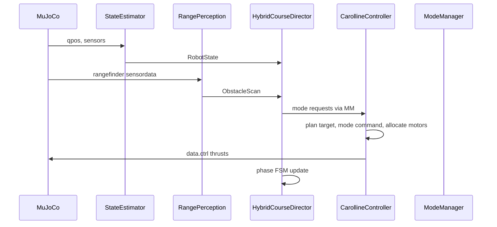

# Chapter 01 — Project Overview

**Previous:** [00-README.md](00-README.md) | **Next:** [02-setup-and-config.md](02-setup-and-config.md)

---

## What is CAROLLINE?

CAROLLINE is a **caged quadcopter** that can:

1. **Roll** on the ground inside a spherical cage (omnidirectional, bidirectional motor thrust).
2. **Recover** from arbitrary orientations on the ground (PRETAKEOFF controller).
3. **Take off and fly** using geometric SE(3) control (Lee et al. 2010).
4. **Land** and resume rolling.

This repository is a **MuJoCo simulation** of that system—not physical hardware. It implements the paper's rolling and hybrid locomotion stack plus an **autonomous navigation course** (walls, terrain, checkpoints).

---

## Repository layout

```
E:\CAROLLINE_PROJECT\                    ← git root, run commands here
├── README.md
├── mujoco_menagerie-main/skydio_x2/     ← robot + cage XML meshes
└── carolline_control/                   ← Python package (~103 files)
    ├── main.py                          ← default hybrid mission sim
    ├── carolline_controller.py          ← control stack integrator
    ├── config.yaml                      ← main tuning parameters
    ├── controllers/                     ← rolling, flight, modes, LQR, MPC
    ├── navigation/                      ← autonomous course director
    ├── scripts/                         ← 24 runnable tools
    ├── validation/                      ← Monte Carlo framework
    ├── terrain/                         ← heightfield scenes
    ├── logging/, plots/, utils/
    └── docs/curriculum/                 ← this course
```

---

## Three software layers

| Layer | Responsibility | Key modules |
|-------|----------------|-------------|
| **Simulation** | MuJoCo physics, terrain, walls, markers | `terrain/`, `navigation/course_scene.py`, `visualization/` |
| **Control stack** | Modes, rolling, flight, motors | `carolline_controller.py`, `controllers/` |
| **Mission** | Checkpoints, wall detect, fly-over FSM | `navigation/director.py`, `perception.py`, `rolling_follower.py` |

The mission layer sits **above** the control stack: the director calls `request_takeoff()`, `request_flight()`, etc., but does not compute motor thrusts directly.

---

## Data flow (one timestep)



---

## Entry points

| Command | Purpose |
|---------|---------|
| `python -m carolline_control.main` | Default mission: roll → fly cardinal legs → land |
| `python carolline_control/scripts/simulate_autonomous_course.py` | Full terrain course with walls |
| `python carolline_control/scripts/manual_teleop.py` | Keyboard teleop for debugging |
| `python -m carolline_control.validation` | Monte Carlo validation campaigns |

See [Chapter 14](14-scripts-and-entry-points.md) for all scripts.

---

## What you built (recent work)

The **autonomous course** subsystem adds:

- Terrain heightfield with hills and a V-ditch after wall 2
- Two vertical walls on checkpoint legs 
- Rangefinder-based wall detection
- `HybridCourseDirector` FSM: roll–fly–roll–terrain-hop–goal
- Flight logging, actual-vs-desired plots, video recording

Deep dive: [Chapter 12](12-autonomous-navigation.md).

---

## Checkpoint

Skim [README.md](../../../README.md) and list the `carolline_control/` folders. You should recognize controllers, navigation, scripts, and validation.

**Next:** [Chapter 02 — Setup and config](02-setup-and-config.md)
