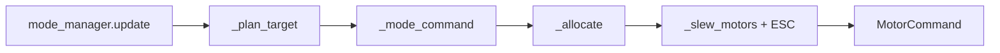

# Chapter 06 — Control Stack Overview

**Previous:** [05-state-estimation.md](05-state-estimation.md) | **Next:** [07-mode-manager-and-planner.md](07-mode-manager-and-planner.md)

---

## The heart: `CarollineController.compute()`

File: [carolline_controller.py](../../carolline_controller.py)

Docstring defines the pipeline:

```
Sensors → StateEstimator → ModeManager →
(Rolling | Flight | PreTakeoff) → Attitude → Torque → Mixer → MuJoCo
```

---

## One timestep trace



### Step 1 — Mode update

```python
mode = self.mode_manager.update(state, dt, mission_complete=self.planner.mission_complete)
```

Side effects on transitions:

- Entering **FLIGHT** → `planner.begin_flight(state, yaw)`
- Leaving **ROLLING** → `rolling.reset()`
- Entering **PRETAKEOFF** → `pre_takeoff.reset(state)`

### Step 2 — `_plan_target(state, mode, dt)`

Returns `TrajectoryTarget` for the active mode:

| Mode | Target source |
|------|---------------|
| FLIGHT | `planner.update()` — moving waypoint |
| ROLLING | `planner.rolling_target_position()` — roll_target XY |
| TAKEOFF/HOVER | Fixed hover anchor XY + hover_height |
| LANDING | spawn XY + landing_height |
| IDLE | Hold current pose |

### Step 3 — `_mode_command(state, mode, target)`

Dispatches to sub-controller → `ControlCommand`:

| Mode | Controller |
|------|------------|
| PRETAKEOFF, UPRIGHT | `pre_takeoff.compute` |
| ROLLING | `rolling.compute` + `planner.rolling_velocity` hook |
| TAKEOFF | `flight.takeoff_thrust` |
| HOVER | `flight.hover` |
| FLIGHT | `flight.compute` |
| LANDING | `flight.compute` with landing logic |

The **rolling velocity hook** is how navigation injects patrol commands:

```python
controller.planner.rolling_velocity = lambda state: follower.velocity_command_xy(state, scan)
```

### Step 4 — `_allocate(cmd, state, mode)`

Turns wrench command into four motor thrusts:

| Branch | Path |
|--------|------|
| IDLE | Zeros |
| ROLLING | `rolling.allocate` — contact-frame Q allocation |
| PRETAKEOFF/UPRIGHT/LANDING (tilted) | `pre_takeoff.allocate` |
| Airborne | attitude → torque → `mixer.mix` |

Gain selection: `(kR_pre, kOmega_pre)` on ground recovery; `(kR, kOmega)` in flight.

### Step 5 — `_slew_motors` + ESC

- Limits per-step thrust change: `motor_slew_rate * dt`
- [esc_mapper.py](../../controllers/esc_mapper.py) applies bidirectional ESC curve

### Step 6 — Diagnostics

`_build_diagnostics()` fills `ControlDiagnostics` for CSV logging.

---

## Return value

```python
return motor, cmd, mode, target
```

Scripts assign `data.ctrl[:] = motor.thrusts` and log `(state, mode, cmd, motor, target)`.

---

## Manual control path

`compute_manual()` — used by teleop; bypasses automatic mode manager transitions.

---

## Checkpoint

```powershell
python -m carolline_control.main --no-viewer
```

Watch console for lines like `mode: ROLLING -> PRETAKEOFF`. Map each transition to [Chapter 07](07-mode-manager-and-planner.md).

**Next:** [Chapter 07 — Mode manager and planner](07-mode-manager-and-planner.md)
