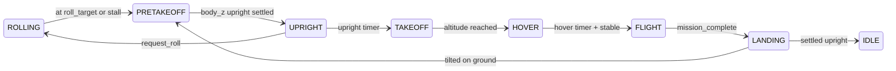

# Chapter 07 — Mode Manager and Planner

**Previous:** [06-control-stack-overview.md](06-control-stack-overview.md) | **Next:** [08-rolling-and-ground-control.md](08-rolling-and-ground-control.md)

---

## Mode manager FSM

File: [controllers/mode_manager.py](../../controllers/mode_manager.py)

Automatic transitions implement CAROLLINE paper Sec. III. The director can **override** via request API during missions.

### Ground / mission branch



### Key thresholds (from config)

| Transition | Condition |
|------------|-----------|
| ROLLING → PRETAKEOFF | Within `roll_position_tolerance` of `roll_target`, slow speed |
| PRETAKEOFF → UPRIGHT | `body_z_world(R)[2] >= upright_cos_threshold` |
| UPRIGHT → TAKEOFF | `upright_timer >= upright_settle_time` |
| TAKEOFF → HOVER | Near `hover_height`, low velocity |
| HOVER → FLIGHT | `hover_timer >= hover_before_flight_time` |
| FLIGHT → LANDING | `planner.mission_complete` |

### Director request API

| Method | Effect |
|--------|--------|
| `request_takeoff()` | Ground recovery for flight |
| `request_flight()` | Jump to FLIGHT (terrain hop from ditch) |
| `request_landing()` | Start descent |
| `request_roll()` | Resume ROLLING after landing |
| `request_ground_recovery(resume_rolling=True)` | PRETAKEOFF with roll resume flag |
| `request_idle()` | Mission complete |

Timers: `hover_timer`, `upright_timer`, `rolling_stall_timer`, `landing_timer`.

---

## Trajectory planner

File: [controllers/planner.py](../../controllers/planner.py)

### Minimum-jerk segments

Between waypoints `p0` and `p1` over duration `T = segment_duration`:

- Normalized time `tau = segment_time / T`
- Polynomial `s(tau)` gives smooth position, velocity, acceleration
- Coefficients in `_min_jerk_coefficients()`

### Key methods

| Method | Role |
|--------|------|
| `begin_flight(state, yaw)` | Snapshot start pose; optionally prepend "home" waypoint |
| `update(state, dt)` | Advance segment; return `TrajectoryTarget` |
| `reset()` | Restart waypoint index |
| `mission_complete` | True after final segment |

### Dwell behavior

At waypoint: hold zero velocity for `waypoint_dwell_time`, then advance segment.

### Rolling helpers

- `rolling_target_position(state)` — XY from `config.roll_target`, Z from hover/ground
- `rolling_velocity` — optional external hook (navigation follower)

---

## Interaction with autonomous course

Director replaces waypoints at runtime:

```python
self.ctrl.planner._mission_waypoints = [lift, cruise, approach]
self.ctrl.planner.reset()
```

Segment duration still comes from `config.segment_duration` (6 s default)—a tuning lever for smoother flight.

---

## Checkpoint

Read `ModeManager.update()` and find the HOVER → FLIGHT condition. Change `hover_before_flight_time` in config and observe delay in `main.py`.

**Next:** [Chapter 08 — Rolling and ground control](08-rolling-and-ground-control.md)
