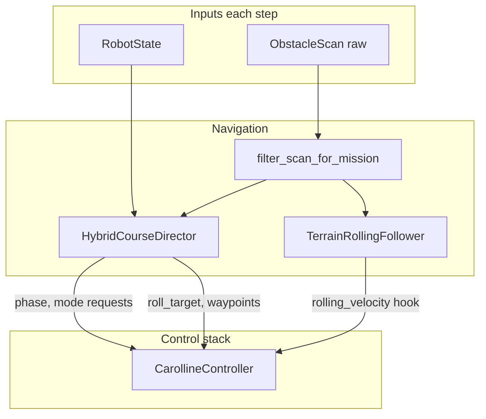

# Chapter 12 — Autonomous Navigation

**Previous:** [11-alternative-controllers-lqr-mpc.md](11-alternative-controllers-lqr-mpc.md) | **Next:** [13-terrain-and-scenes.md](13-terrain-and-scenes.md)

This is the deepest chapter: the roll–fly–roll mission you built for the terrain course.

---

## Architecture



Entry script: [simulate_autonomous_course.py](../../scripts/simulate_autonomous_course.py)

---

## Course layout

File: [course_layout.py](../../navigation/course_layout.py)

### Data structures

**`WallSpec`** — one vertical wall:

- `x, y, length, width, height, yaw_deg, leg_index`
- `center_xy()`, `face_normal_xy()` for geometry

**`CourseLayout`** — full mission:

| Field | Course value |
|-------|--------------|
| spawn | (-10, 0) |
| checkpoints | (-6,0), (-2,0), (3,1), (8,0) |
| goal | (10.5, 0) |
| walls | leg 1 @ x=-4; leg 2 @ x=1.5 |

### Waypoint generators

**`fly_over_waypoints(wall, terrain_z_at, leg_index)`**

Returns `(pre, over, post)` 3D points:

- `pre` — before wall along leg bearing
- `over` — above wall at `ground + wall.height + fly_clearance`
- `post` — landing XY beyond wall

**`terrain_hop_waypoints(start, end, terrain_z_at, current_z=...)`**

Returns `(lift, cruise, approach)` for ditch/hill hops:

- Samples max terrain height along path
- `lift_z` boosted by `current_z + 0.70` when starting in a ditch

**`load_course_layout()`** — parses [course_config.yaml](../../navigation/course_config.yaml)

---

## Perception — line-by-line

File: [perception.py](../../navigation/perception.py)

### `ObstacleScan` (lines 14–21)

Dataclass holding one scan snapshot:

- `forward_min_m` — closest forward hit distance
- `upward_clear_m` — upward ray distance
- `blocked` — True if forward < stop_distance (0.65 m)
- `flyable` — blocked ahead but enough clearance above to fly

### `RangePerception.__init__` (lines 27–64)

- Finds all MuJoCo sensors named with `RANGE_SENSOR_PREFIX`
- Builds fan of 7 forward angles: -60° to +60°
- One upward sensor (`_up` suffix)

### `scan()` (lines 80–118)

For each sensor:

1. `_read_range()` — clamp invalid to `max_range` (8 m)
2. Forward cone: keep rays with `|angle| <= forward_cone_deg`
3. `forward_min_m` = minimum forward distance
4. **`blocked`** = `forward_min_m < stop_distance`
5. **`flyable`** = blocked AND `upward_clear_m > fly_clearance` AND forward > 0.05 m

### `filter_scan_for_mission()` (lines 121–159)

Mission-aware filtering:

```python
wall = layout.wall_for_leg(checkpoint_index)
has_internal_wall = wall is not None and leg not in cleared_legs
blocked = scan.blocked and has_internal_wall
```

Also clears false positives:

- **Final approach** to goal → never blocked
- **Terrain perimeter** near boundary → ignore blocked when no wall on leg

Returns possibly modified `ObstacleScan` (HUD shows `raw_blocked` vs `mission_blocked`).

---

## Rolling follower

File: [rolling_follower.py](../../navigation/rolling_follower.py)

### `velocity_command_xy(state, scan)`

1. If disabled → zero velocity
2. If `scan.blocked` and `respect_blocked_scan` → **stop** (zero cmd)
3. Direction = unit vector to `_target_xy`
4. Speed = `patrol_speed`, slowed inside `patrol_slowdown_radius`
5. `_grade_speed_scale()` — reduce speed on steep terrain ahead
6. Cap at `rolling_max_speed`

Director sets `respect_blocked_scan = True` only when an **uncleared wall** blocks the current leg.

---

## Director FSM — line-by-line

File: [director.py](../../navigation/director.py)

### Phases (`CoursePhase` enum)

| Phase | Meaning |
|-------|---------|
| `ROLL_TO_CHECKPOINT` | Normal rolling |
| `ROLL_RECOVER` | Reorient after terrain stall |
| `BLOCKED_RECOVER` | Upright before wall fly-over |
| `TAKEOFF_OVER` | Climbing before flight segment |
| `FLY_OVER` | Wall hop in progress |
| `LAND_BEYOND` | Landing past wall |
| `FLY_TERRAIN` | Air hop over ditch/hills |
| `LAND_TERRAIN` | Landing after terrain hop |
| `DONE` | Goal reached |

### `begin(t)`

- Checkpoint 0, roll target = first checkpoint
- Phase → `ROLL_TO_CHECKPOINT`

### `update()` — `ROLL_TO_CHECKPOINT` block

Each step:

1. Set `roll_target` from follower
2. Enable follower only in this phase
3. **Goal check** → DONE
4. **Ditch detection** `_in_post_wall_ditch()` → immediate `FLY_TERRAIN`
5. **Stall** `_rolling_stuck()` → ROLL_RECOVER or terrain hop
6. **Checkpoint arrival** → advance index
7. **Wall detection** (lines 322–339):

```python
if wall and leg not in cleared_legs:
    if mission_scan.blocked or speed < 0.12:
        blocked_timer += dt
    if blocked_timer >= blocked_confirm_time:  # 0.30 s
        if mission_scan.flyable or wall.height > max_roll_height:
            → BLOCKED_RECOVER
```

### Wall fly-over sequence

1. `BLOCKED_RECOVER` → `request_takeoff()`
2. `TAKEOFF_OVER` → `FLY_OVER` via `_start_fly_over()`
3. `FLY_OVER` → near post waypoint → `request_landing()` → `LAND_BEYOND`
4. Settled → add leg to `_cleared_legs`, advance checkpoint
5. **After wall leg 2:** `_start_terrain_hop(..., immediate_flight=True)` instead of rolling into ditch

### Terrain hop

`_start_terrain_hop()`:

- Sets 3 planner waypoints (lift, cruise, approach)
- `begin_flight()`, disable follower
- If in ditch: `request_flight()` → `FLY_TERRAIN` directly
- Else: `request_takeoff()` → `TAKEOFF_OVER`

`_cleared_legs` prevents re-triggering fly-over on the same wall.

---

## Course scene and logging

| File | Role |
|------|------|
| [course_scene.py](../../navigation/course_scene.py) | Compile terrain + walls + rangefinders |
| [course_logger.py](../../navigation/course_logger.py) | CSV with phase, checkpoint, cmd_speed |
| [course_analysis.py](../../navigation/course_analysis.py) | Actual vs desired plots |
| [sim_recorder.py](../../navigation/sim_recorder.py) | Offscreen MP4 recording |
| [sensor_viz.py](../../navigation/sensor_viz.py) | Red/yellow/green ray overlay |

---

## Main loop (simulate_autonomous_course.py)

```python
def control_step():
    state = estimator.estimate(data)
    scan = perception.scan(data, state)
    motor, cmd, mode, target = controller.compute(state, dt)
    running = director.update(state, mode, state.time, dt, scan)
    data.ctrl[:] = motor.thrusts
    logger.log_course(...)
    return running and t < duration
```

Viewer loop: `substeps` physics steps per frame, tracking camera, HUD text.

---

## Successful run timeline (~49 s)

| Time | Phase |
|------|-------|
| 0–4 s | Roll toward cp 0 |
| 4–8 s | Wall 1: recover → fly → land |
| 13–19 s | Wall 2: recover → fly → land |
| 21–44 s | FLY_TERRAIN over ditch to (8,0) |
| 45–49 s | Roll to goal → DONE |

---

## Checkpoint

```powershell
python carolline_control/scripts/simulate_autonomous_course.py --no-viewer
```

Read every `PHASE ->` line and map to the FSM above.

---

## SLAM exploration (unknown environment)

For missions where obstacle layout is **not** in YAML, use the SLAM stack:

| Module | Role |
|--------|------|
| [odometry.py](../../navigation/odometry.py) | Rolling odom + planar `PoseEKF` |
| [mapping.py](../../navigation/mapping.py) | Log-odds occupancy grid |
| [localization.py](../../navigation/localization.py) | Scan-to-map pose correction |
| [global_planner.py](../../navigation/global_planner.py) | A* on inflated grid |
| [slam_stack.py](../../navigation/slam_stack.py) | Integrates mapper + localizer + planner |
| [exploration_director.py](../../navigation/exploration_director.py) | Roll / replan / fly-over FSM |
| [exploration_scene.py](../../navigation/exploration_scene.py) | Random obstacles + dense rangefinders |
| [slam_config.yaml](../../navigation/slam_config.yaml) | Map, SLAM, and exploration params |

Entry script:

```powershell
python carolline_control/scripts/simulate_slam_exploration.py --slam-nav
python carolline_control/scripts/simulate_slam_exploration.py --oracle --no-viewer
python carolline_control/scripts/simulate_slam_exploration.py --save-map carolline_control/logs/slam_map.png
```

**State estimation modes** (see [05-state-estimation.md](05-state-estimation.md)):

| Flag | Pose source |
|------|-------------|
| default / `--oracle` | MuJoCo `qpos` (controller tuning) |
| `--slam-nav` | IMU + SLAM planar pose (`StateEstimator.slam_odom`) |
| `--sensor-only` | IMU dead reckoning from spawn |

**RViz / ROS:** not used. Map debug via [map_viz.py](../../navigation/map_viz.py) (PNG or matplotlib).

Enable dense rangefinders on the terrain course via `course_config.yaml`:

```yaml
perception:
  dense_rays: true
  dense_ray_count: 24
```

**Next:** [Chapter 13 — Terrain and scenes](13-terrain-and-scenes.md)
